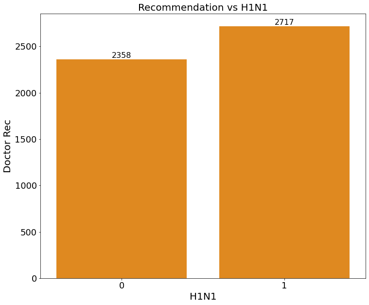
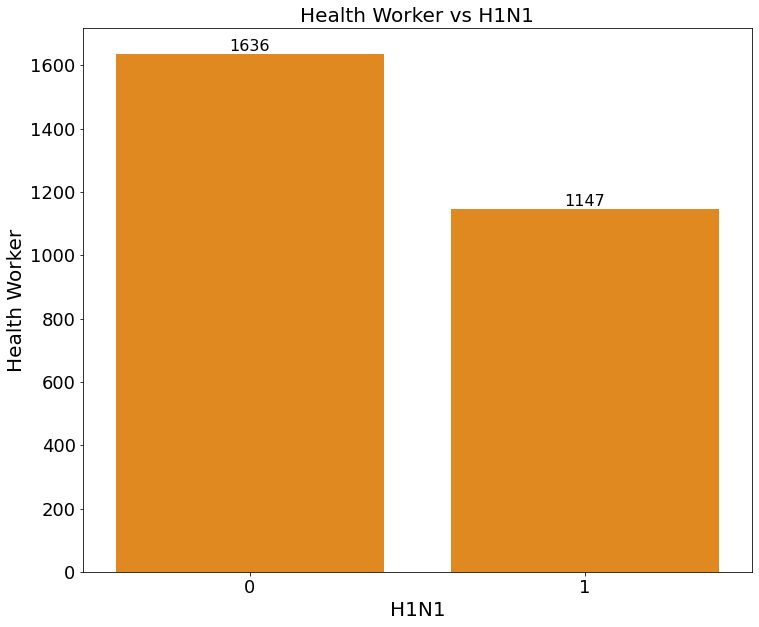
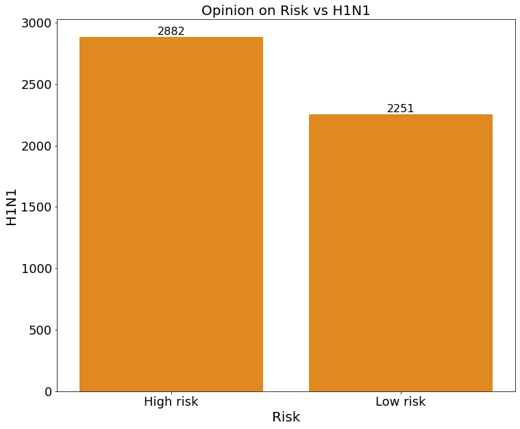
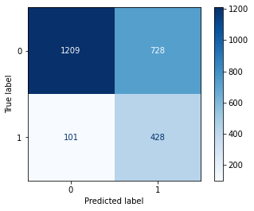

# H1N1 Vaccine Model Analysis

**Author**: [Jack Locke](mailto:jackdlocke@gmail.com)

# Overview
1. Business Understanding
2. Data Understanding
3. Data Preparation
    * a. Merging Datasets
    * b. Dropping Unnecessary Columns
    * c. Handle Missing Values
    * d. Column Manipulation
    * e. Primary Column Information
4. Exploratory Data Analysis
    * a. Doctor Reccommendation vs. H1N1
    * b. Health Worker vs. H1N1
    * c. Opionion on Risk vs. H1N1
5. Modeling
    * a. Train, Validation, Holdout Splits
    * b. Encoding Categorical Columns
    * c. Evaluation Metrics
    * d. Three Baseline Models
        * Logistic Regression
        * Decision Tree Classifier
        * Random Forest Classifier
    * e. Hyperparameter Tuning Best Model
    * f. Final Model
    * g. Adjusting Decision Threshold
        * Different Decision Thresholds
6. Conclusions
    * a. Limitations
    * b. Recommendations/Next Steps

# Business Understanding
The business stakeholder is a healthcare insurance company trying to predict individuals who received H1N1 vaccines so they can send them an additional survey and request medical records to acquire more information/knowledge. The company can use the additional information gained to help make better business decisions on their insurance policies, leading to more growth for the company. My project takes survey data about H1N1 vaccines using information they shared about their backgrounds, opinions, and health behaviors. The model aims to predict whether someone received the H1N1 vaccine or not. The importance of the model revolves around the costs associated with false positives and false negatives. The false positive would be predicting someone did receive the H1N1 vaccine when they didn’t (cost related to sending the survey to the wrong person). The false negative would be predicting someone didn't receive the H1N1 vaccine when they did (missed opportunity). I will find an appropriate trade-off between our two costs, focusing on minimizing missed opportunities. My analysis will use the CRISP-DM (Cross-industry standard process for data mining) methodology.

# Data Understanding
I am working with the National 2009 H1N1 Flu Survey dataset for this project. “In late 2009 and early 2010, the United States conducted the National 2009 H1N1 Flu Survey. This phone survey asked respondents whether they had received the H1N1 and seasonal flu vaccines, in conjunction with questions about themselves. These additional questions covered their social, economic, and demographic background, opinions on risks of illness and vaccine effectiveness, and behaviors towards mitigating transmission.” The dataset contains over 26,000 rows and 38 columns. It is important to note that this is survey data, which, in general, has many limitations and biases. I will discuss these in more detail in the limitations section at the end of the notebook. Below is a link to the dataset and information on each feature.

Citation/Data: https://www.drivendata.org/competitions/66/flu-shot-learning/page/210/

# Data Preparation
* A. Merging Datasets
* B. Dropping Unnecessary Columns
* C. Handle Missing Values
* D. Column Manipulation
* E. Primary Columns Information

# Exploratory Data Analysis
As mentioned, my EDA will focus on the three most significant coefficient estimates, which had some of the largest impacts on our model. I will explore their relationships to our target variable, the H1N1 vaccine. This will help me understand patterns and trends within our dataset.

### H1N1 vs. Doctor Recommendation

### H1N1 vs. Health Worker

### H1N1 vs. Opinion on Risk


# Model
In the modeling section of my notebook, I will split the dataset into three groups (train, valid, and holdout). The purpose is to demonstrate if our model is generalizable or not. This is a crucial step because if our model cannot perform similarly on both training data and unseen data, it will defeat the purpose of the model/project (the model has no value to the company). After that, I will encode the categorical columns in the vaccine dataframe to convert their values to binary. Otherwise, our models will not produce any results.

After that, I assessed the performance of three different binary classification models on the training data. The logistic regression model demonstrated the best fit, so I continued with that model. I then hyperparameter-tuned the logistic regression model with the training and validation data. I used a grid search to help give guidance/suggestions into what parameters were best. From there, I concluded my final model, Logistic Regression, and ran the holdout data to confirm the model was performing similarly on the training data, validation data, and holdout data. After I confirmed it was, I adjusted the decision threshold in favor of recall to create three scenarios so the stakeholders can decide the cost trade-off that suits their business the best. 

* Scenarios with different decision thresholds to show stakeholders

    * Decision threshold 0.5: recall = ~72%, ~18% FP, cost = $1,800

    * Decision threshold 0.4: recall = ~81%, ~30% FP, cost = $3,000 

    * Decision threshold 0.3: recall = ~91%, ~48% FP, cost = $4,800
    
* **Final Model: Logistic Regression (max_iter=100, random_state=42,class_weight='balanced', C=.006,solver='liblinear')




# Conclusion
My Exploratory Data Analysis presents the relationship between three features with high coefficient estimates with the target variable, H1N1 vaccines. Additional information on these features should be included in the follow-up survey. My model uses the information from all the features to help predict who received H1N1 vaccines, focusing on minimizing missed opportunity costs. The additional information gained from the follow-up survey and potential medical records would improve the insurance company’s knowledge, leading to better business decisions on their insurance policies. This will lead to more overall growth for the company. Given these findings and data enrichment in the future, I can build on my model recommendation and know where to proceed next.

## Limitations
At this stage, the data is limited, which is why the company wants to conduct additional surveys and obtain medical records. I do not have all the information on H1N1 vaccines. Specifically, I removed health insurance and employment information because it was missing too much data. Due to the lack of data, I cannot confidently say which features have the highest impact on determining if someone received the H1N1 vaccine, but I can show what is impactful at this time and recommend looking into it further. With data enrichment in the future (through the follow-up survey), I can start to reduce this limitation.

Additionally, survey data can be biased, inaccurate, and unreliable. Some people might not answer the survey truthfully because of outside factors, which could skew the results of any model I create. The company is also looking to acquire medical records to reduce this limitation.

## Recommendations/Next Steps
For the follow-up survey, I recommend acquiring more data on health insurance, employment, and the three features I explored in the EDA. I also recommend using the logistic regression model. I give the stakeholders three different threshold options to decide the best cost trade-off between missed opportunity costs and the cost of sending the survey to the wrong individual. I want to reduce the information limitation by acquiring more data through the follow-up survey. I also want to obtain medical records to reduce the limitations of biased/unreliable survey data. The additional information should help me create a more reliable model in the future, leading to more knowledge and overall growth for the company. 

* 1. Doctor Recommendation
* 2. Health Worker
* 3. Opinion on H1N1 risk
* 4. Health Insurance
* 5. Employment Information
* 6. Medical Records
* 7. Logistic Regression Model
* 8. Decide Cost Trade-off

## For More Information

See the full analysis in the [Jupyter Notebook](notebook.ipynb) or review this [presentation](presentation.pdf).

For additional info, contact Jack Locke at [jackdlocke@gmail.com](mailto:jackdlocke@gmail.com)

## Repository Structure

```
├── data
├── images
├── README.md
├── presentation.pdf
└── notebook.ipynb
```
## Citations

* 1: https://www.drivendata.org/competitions/66/flu-shot-learning/page/210/
* 2: https://stackoverflow.com/questions/57924484/finding-coefficients-for-logistic-regression
* 3: https://www.geeksforgeeks.org/ml-one-hot-encoding/
* 4: https://scikit-learn.org/1.5/modules/cross_validation.html
* 5: https://scikit-learn.org/1.5/modules/generated/sklearn.metrics.f1_score.html
* 6: https://scikit-learn.org/1.5/modules/generated/sklearn.metrics.recall_score.html
* 7: https://scikit-learn.org/1.5/modules/generated/sklearn.ensemble.RandomForestClassifier.html
* 8: https://scikit-learn.org/1.5/modules/generated/sklearn.model_selection.GridSearchCV.html
* 9: https://www.geeksforgeeks.org/what-is-the-default-threshold-in-sklearn-logistic-regression/